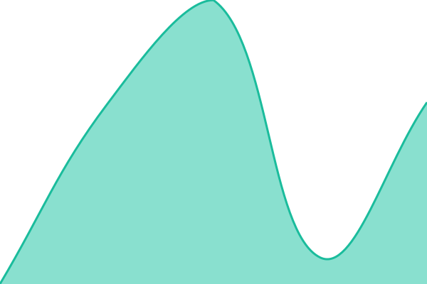
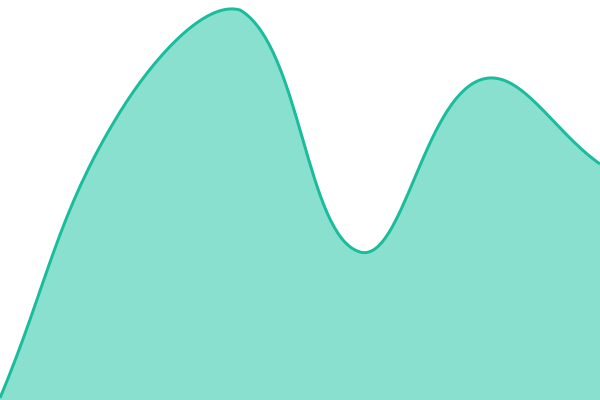

# [📈 Live Status](https://status.redacted.gg): <!--live status--> **🟩 All systems operational**

This repository contains the open-source uptime monitor and status page for [Redacted](redacted.gg), powered by [Upptime](https://github.com/upptime/upptime).

With [Upptime](https://upptime.js.org), you can get your own unlimited and free uptime monitor and status page, powered entirely by a GitHub repository. We use [Issues](https://github.com/redactedLabs/status/issues) as incident reports, [Actions](https://github.com/redactedLabs/status/actions) as uptime monitors, and [Pages](https://status.redacted.gg) for the status page.

<!--start: status pages-->
<!-- This summary is generated by Upptime (https://github.com/upptime/upptime) -->
<!-- Do not edit this manually, your changes will be overwritten -->
<!-- prettier-ignore -->
| URL | Status | History | Response Time | Uptime |
| --- | ------ | ------- | ------------- | ------ |
|  [Redacted app](https://ruji.redacted.money) | 🟩 Up | [app.yml](https://github.com/redactedLabs/status/commits/HEAD/history/app.yml) | 

 617ms
     
 | 

<a href="https://status.redacted.gg/history/app">100.00%</a>
    

|  [Redacted node](https://ruji.redacted.money/private-api/v2/relayer) | 🟩 Up | [node.yml](https://github.com/redactedLabs/status/commits/HEAD/history/node.yml) | 

 540ms
     
 | 

<a href="https://status.redacted.gg/history/node">100.00%</a>
    

|  [Ozone screening](https://ozone.redacted.gg/api/health) | 🟩 Up | [ozone.yml](https://github.com/redactedLabs/status/commits/HEAD/history/ozone.yml) | 

 627ms
     
 | 

<a href="https://status.redacted.gg/history/ozone">100.00%</a>
    

|  [Ozone website](https://ozone.redacted.gg) | 🟩 Up | [ozone-website.yml](https://github.com/redactedLabs/status/commits/HEAD/history/ozone-website.yml) | 

 2011ms
     
 | 

<a href="https://status.redacted.gg/history/ozone-website">100.00%</a>
    

|  [THORChain RPC](https://rpc.redacted.money/status) | 🟩 Up | [rpc.yml](https://github.com/redactedLabs/status/commits/HEAD/history/rpc.yml) | 

 375ms
     
 | 

<a href="https://status.redacted.gg/history/rpc">100.00%</a>
    

|  [THORChain API](https://api.redacted.money/thorchain/lastblock) | 🟩 Up | [api.yml](https://github.com/redactedLabs/status/commits/HEAD/history/api.yml) | 

 594ms
     
 | 

<a href="https://status.redacted.gg/history/api">100.00%</a>
    

|  [Website](https://redacted.gg) | 🟩 Up | [website.yml](https://github.com/redactedLabs/status/commits/HEAD/history/website.yml) | 

 231ms
     
 | 

<a href="https://status.redacted.gg/history/website">100.00%</a>
    

|  [Docs](https://redacted.gg/docs/) | 🟩 Up | [docs.yml](https://github.com/redactedLabs/status/commits/HEAD/history/docs.yml) | 

 138ms
     
 | 

<a href="https://status.redacted.gg/history/docs">100.00%</a>
    

<!--end: status pages-->

[**Visit our status website →**](https://status.redacted.gg)

## 📄 License

- Powered by: [Upptime](https://github.com/upptime/upptime)
- Code: [MIT](./LICENSE) © [Anand Chowdhary](https://anandchowdhary.com)
- Data in the `./history` directory: [Open Database License](https://opendatacommons.org/licenses/odbl/1-0/)
